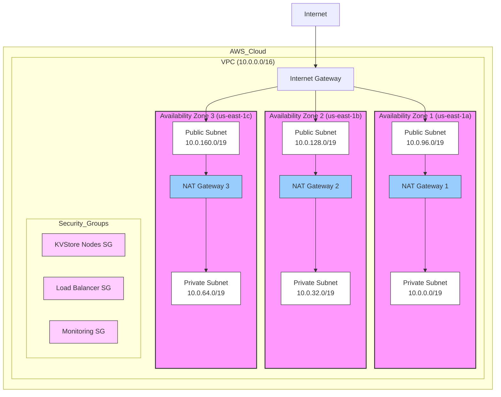
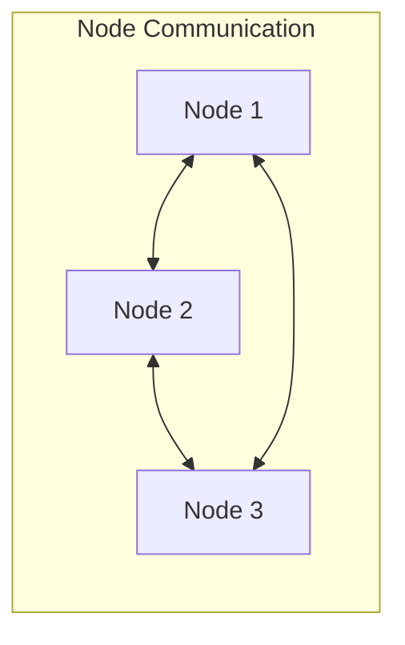
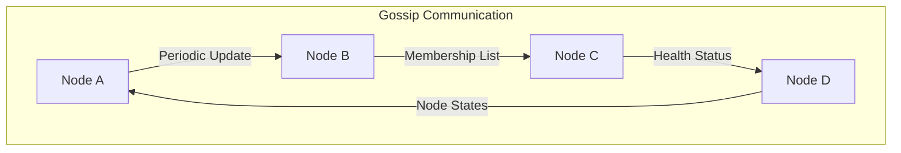

# Distributed Key-Value Store Infrastructure Documentation

## Infrastructure Overview

### Architecture Diagram


## Component Details

### 1. VPC Configuration
- **CIDR Block**: 10.0.0.0/16 (65,536 IP addresses)
- **Region**: us-east-1
- **Availability Zones**: 3 (us-east-1a, us-east-1b, us-east-1c)

#### Subnet Layout
| Subnet Type | Availability Zone | CIDR Block    | Size  | Purpose |
|-------------|------------------|---------------|-------|---------|
| Private     | us-east-1a       | 10.0.0.0/19   | 8,192 | KV Store Nodes |
| Private     | us-east-1b       | 10.0.32.0/19  | 8,192 | KV Store Nodes |
| Private     | us-east-1c       | 10.0.64.0/19  | 8,192 | KV Store Nodes |
| Public      | us-east-1a       | 10.0.96.0/19  | 8,192 | NAT Gateway/LB |
| Public      | us-east-1b       | 10.0.128.0/19 | 8,192 | NAT Gateway/LB |
| Public      | us-east-1c       | 10.0.160.0/19 | 8,192 | NAT Gateway/LB |

### 2. NAT Gateway Configuration
- One NAT Gateway per AZ for high availability
- Enables private subnet resources to access internet
- Placed in public subnets
- Each private subnet routes through its AZ's NAT Gateway

### 3. Security Group Design

#### KV Store Nodes Security Group
```plaintext
Inbound Rules:
- TCP 8080: Client API connections (VPC CIDR)
- TCP 7946: Peer-to-peer communication (Self)
- UDP 7947: Gossip protocol (Self)

Outbound Rules:
- All traffic: 0.0.0.0/0
```

#### Load Balancer Security Group
```plaintext
Inbound Rules:
- TCP 8080: Client API Access (0.0.0.0/0)

Outbound Rules:
- All traffic: 0.0.0.0/0
```

#### Monitoring Security Group
```plaintext
Inbound Rules:
- TCP 9090: Prometheus (VPC CIDR)
- TCP 9100: Node Exporter (VPC CIDR)

Outbound Rules:
- All traffic: 0.0.0.0/0
```

## Communication Patterns

### 1. Peer-to-Peer Communication (Port 7946)
- Used for direct node-to-node communication
- Handles:
  - Data replication
  - Read/write quorum operations
  - State transfers
  - Consistent hashing ring updates



### 2. Gossip Protocol (Port 7947)
The gossip protocol is crucial for maintaining cluster membership and failure detection:



#### How Gossip Works:
1. **Periodic Updates**:
   - Each node maintains a membership list
   - Nodes periodically share their state
   - Updates include node health and versions

2. **Failure Detection**:
   - Nodes track last-heard time from peers
   - Missing updates trigger suspicion
   - Multiple confirmations mark node as failed

3. **State Propagation**:
   - Updates spread exponentially
   - Each round, nodes pick random peers
   - Eventually consistent membership view

### 3. Client API Communication (Port 8080)
- External access through load balancer
- RESTful API for key-value operations
- TLS encryption for security

## Infrastructure Management

### 1. Terraform Structure
```plaintext
.
├── alb/
├── backend.tf       # S3 state configuration
├── main.tf         # Root module configuration
├── nacls/
├── nat/            # NAT Gateway configuration
├── outputs.tf      # Infrastructure outputs
├── provider.tf     # AWS provider configuration
├── security_groups/
├── variables.tf    # Input variables
├── vpc/           # VPC configuration
└── vpc-flow/
```

### 2. Resource Naming Convention
- Format: `${project}-${environment}-${resource}-${additional_info}`
- Example: `kvstore-dev-sg-nodes`

### 3. Tagging Strategy
```hcl
default_tags = {
  Environment = "dev"
  Project     = "kvstore"
  ManagedBy   = "terraform"
  Region      = "us-east-1"
}
```


This documentation provides a comprehensive overview of our current infrastructure. The peer-to-peer and gossip protocol configurations are essential for our distributed key-value store to maintain consistency, handle failures, and manage membership across nodes.