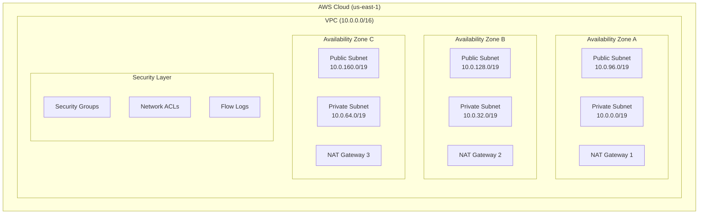
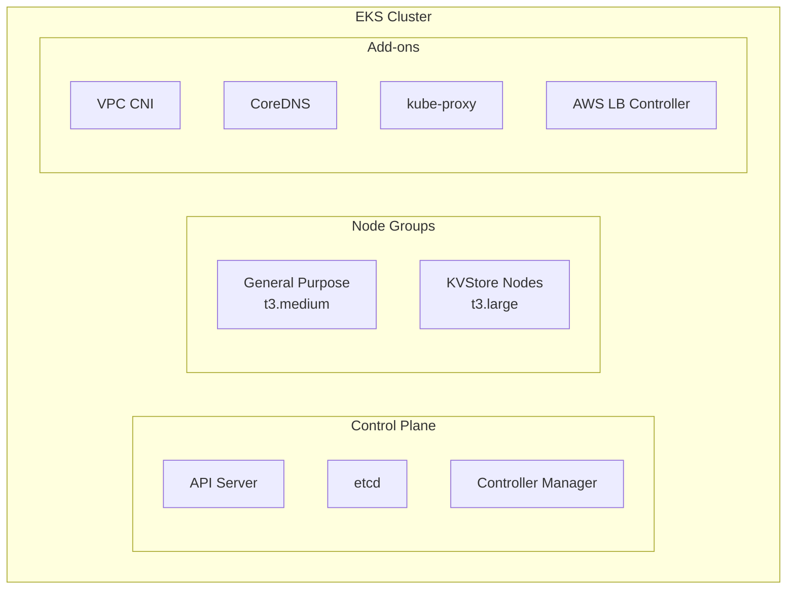
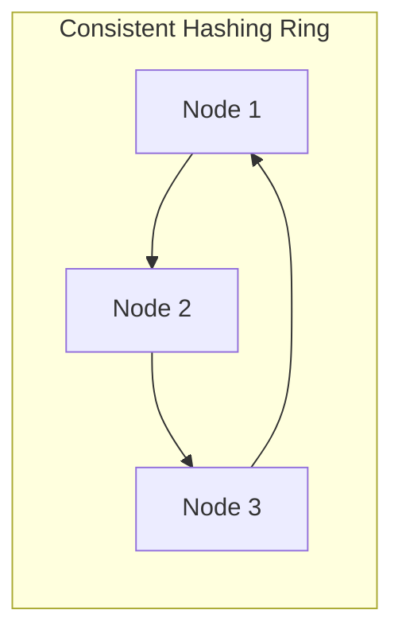
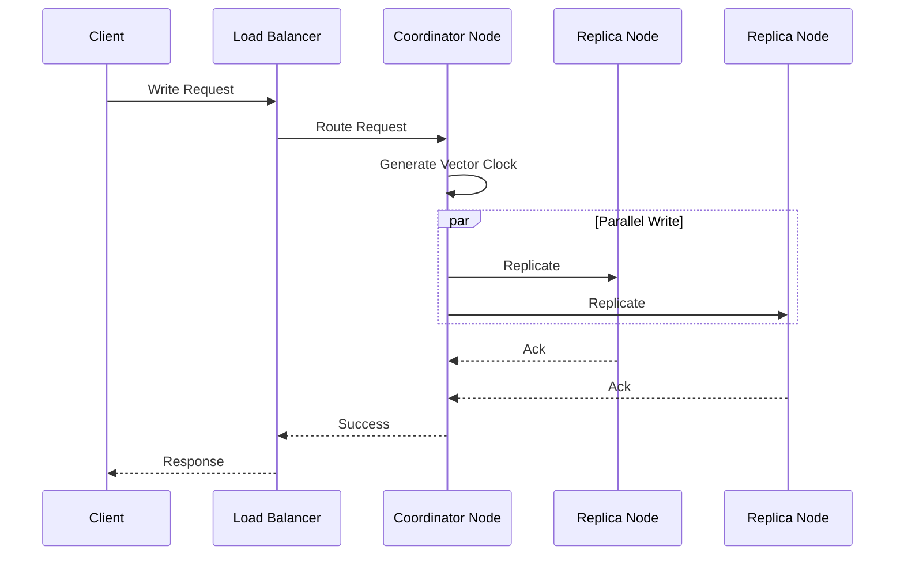
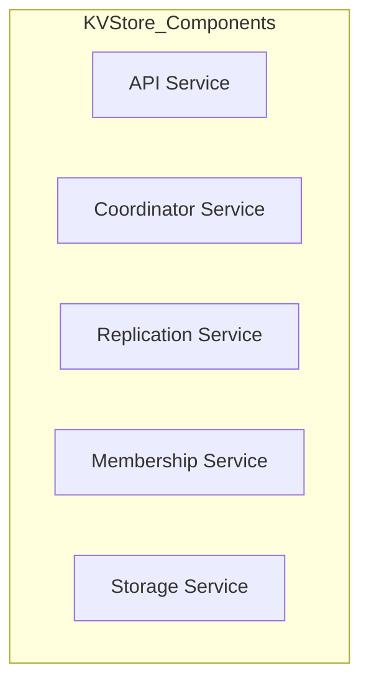

# Distributed Key-Value Store Architecture Documentation

## 1. Infrastructure Architecture

### 1.1 Network Layer


### 1.2 Compute Layer (EKS)


## 2. Key-Value Store Design

### 2.1 Data Distribution


### 2.2 Key Components

1. **Consistent Hashing**
   - Ring-based topology
   - Virtual nodes for better distribution
   - Node addition/removal handling
   ```plaintext
   Hash Space: [0 - 2^128-1]
   Virtual Nodes per Physical Node: 128
   Distribution Algorithm: SHA-256
   ```

2. **Vector Clocks**
   - Causality tracking
   - Conflict detection
   - Version reconciliation
   ```plaintext
   Format: {node_id: counter}
   Example: {node1: 1, node2: 3, node3: 2}
   ```

3. **Replication**
   - N copies (configurable)
   - Preference list generation
   - Quorum-based operations
   ```plaintext
   N = 3 (replicas)
   W = 2 (write quorum)
   R = 2 (read quorum)
   ```

4. **Gossip Protocol**
   - Membership management
   - Failure detection
   - State dissemination
   ```plaintext
   Gossip Interval: 1 second
   Failure Detection: Phi-accrual
   Suspicion Threshold: 5 seconds
   ```

### 2.3 Data Flow



## 3. Reliability Patterns

### 3.1 Write Path
```plaintext
1. Client Request → Load Balancer
2. Route to Coordinator Node
3. Update Vector Clock
4. Write to Local Storage
5. Replicate to N-1 nodes
6. Wait for W-1 acknowledgments
7. Respond to Client
```

### 3.2 Read Path
```plaintext
1. Client Request → Load Balancer
2. Route to Coordinator Node
3. Read from Local Storage
4. Request from R-1 replicas
5. Vector Clock Comparison
6. Resolve Conflicts
7. Return Latest Version
```

### 3.3 Failure Handling
1. **Node Failure**
   - Detection via gossip
   - Rebalance ring
   - Repair replicas

2. **Network Partition**
   - Sloppy quorum
   - Hinted handoff
   - Anti-entropy repair

3. **Split Brain**
   - Quorum-based resolution
   - Vector clock reconciliation
   - Merkle tree synchronization

## 4. Implementation Components

### 4.1 Core Services


### 4.2 Supporting Services
1. **Health Checking**
   - Liveness probe
   - Readiness probe
   - Startup probe

2. **Metrics & Monitoring**
   - Request latencies
   - Replication lag
   - Storage metrics
   - Network metrics

3. **Operations**
   - Node bootstrap
   - Data migration
   - Version reconciliation
   - State transfer

## 5. Infrastructure Components
```plaintext
├── VPC
│   ├── Public Subnets (3)
│   ├── Private Subnets (3)
│   └── NAT Gateways (3)
├── Security
│   ├── Security Groups
│   ├── NACLs
│   └── Flow Logs
├── EKS
│   ├── Control Plane
│   ├── Node Groups
│   └── Add-ons
└── Load Balancer
    ├── Target Groups
    └── Health Checks
```


