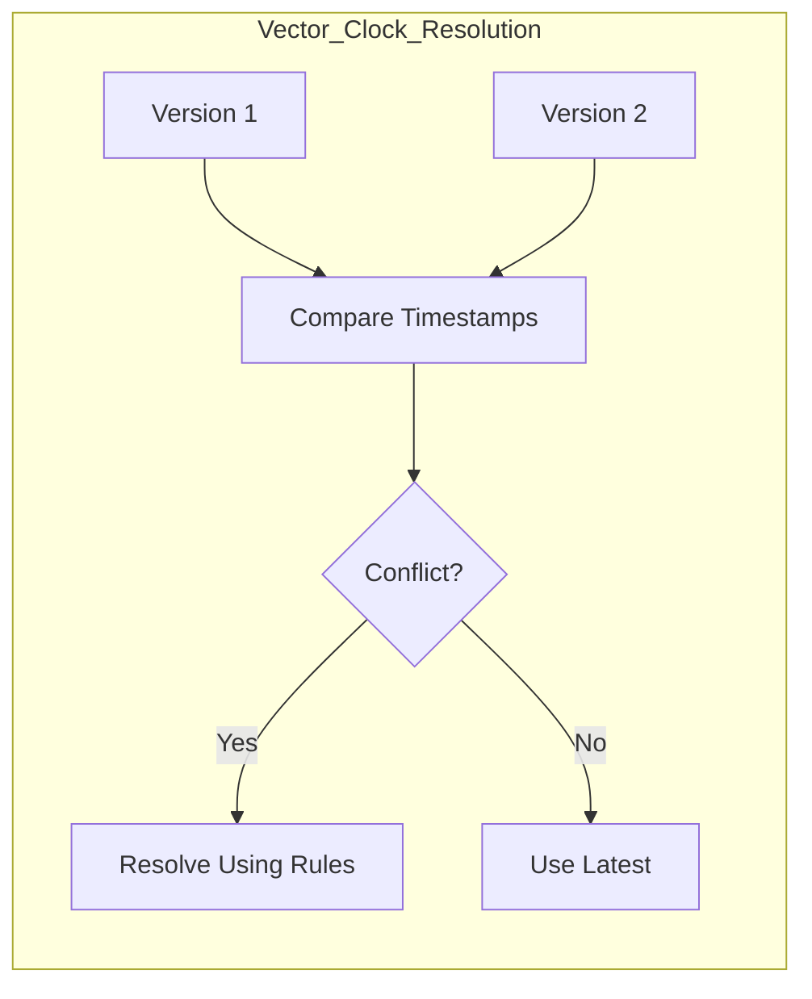
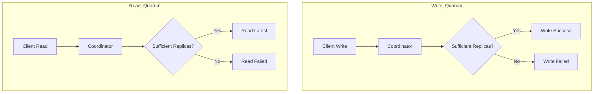
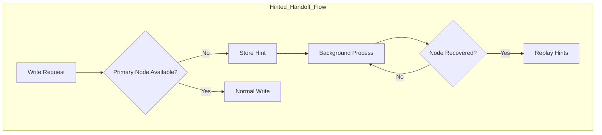
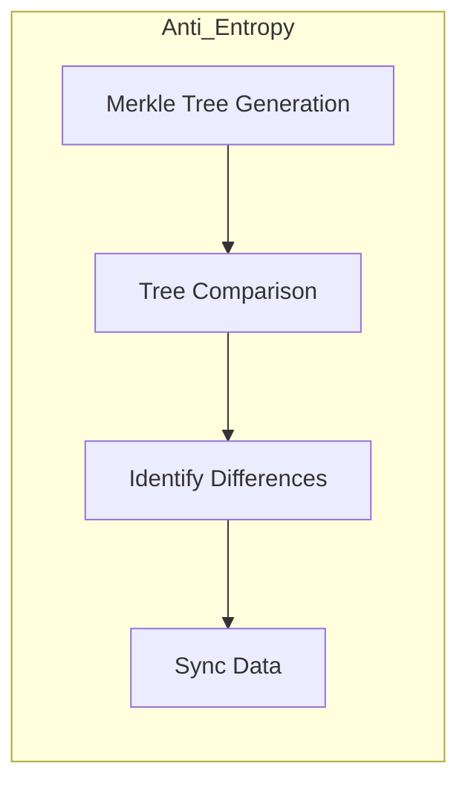
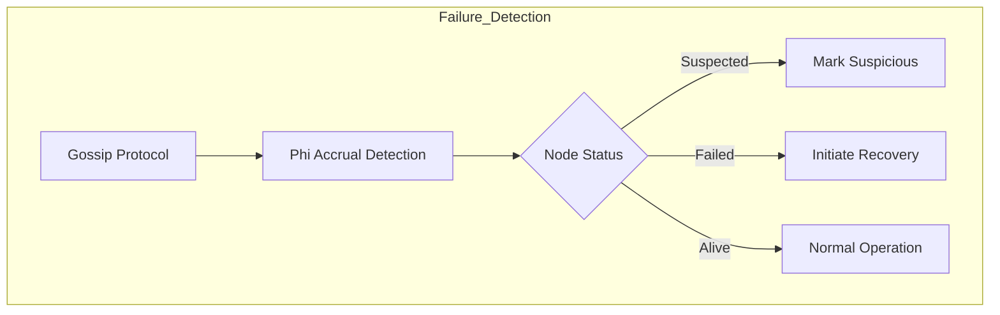
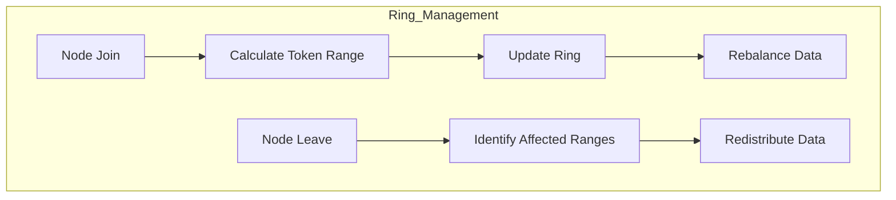
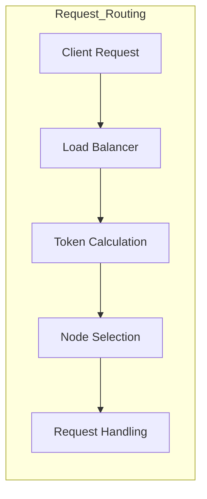

# Reliability Patterns for Distributed Key-Value Store

## 1. Data Consistency Patterns

### 1.1 Vector Clocks Implementation


**Details:**
```json
{
  "vector_clock": {
    "format": {
      "node_id": "counter",
      "timestamp": "unix_epoch"
    },
    "example": {
      "node1": {"counter": 3, "timestamp": 1635789600},
      "node2": {"counter": 2, "timestamp": 1635789500},
      "node3": {"counter": 4, "timestamp": 1635789700}
    }
  },
  "conflict_resolution": {
    "rules": [
      "Compare counters for each node",
      "Check causal relationships",
      "If concurrent, use timestamp as tiebreaker",
      "If still concurrent, merge values"
    ]
  }
}
```

### 1.2 Quorum-Based Operations


**Configuration:**
```yaml
quorum_settings:
  N: 3  # Total replicas
  W: 2  # Write quorum
  R: 2  # Read quorum

consistency_levels:
  strong:
    R: "N"
    W: "N"
  eventual:
    R: 1
    W: 1
  quorum:
    R: "N/2 + 1"
    W: "N/2 + 1"

timing:
  request_timeout: 5s
  replication_timeout: 2s
  retry_interval: 100ms
  max_retries: 3
```

## 2. Failure Handling Patterns

### 2.1 Hinted Handoff


**Implementation:**
```json
{
  "hint_storage": {
    "format": {
      "target_node": "string",
      "key": "string",
      "value": "bytes",
      "timestamp": "unix_epoch",
      "ttl": "duration"
    },
    "maintenance": {
      "check_interval": "1m",
      "retry_interval": "5m",
      "max_attempts": 5,
      "expiry": "24h"
    }
  }
}
```

### 2.2 Anti-Entropy Process


**Process Details:**
```yaml
merkle_tree:
  depth: 16
  hash_function: "SHA-256"
  bucket_size: 1000
  update_interval: 3600s

sync_process:
  scan_interval: 6h
  batch_size: 100
  concurrent_transfers: 3
  bandwidth_limit: "50MB/s"
  priority_levels:
    high: "missing_replicas"
    medium: "inconsistent_replicas"
    low: "background_sync"
```

### 2.3 Failure Detection and Recovery


**Configuration:**
```yaml
gossip_protocol:
  interval: 1s
  fanout: 3
  indirect_probes: 2
  probe_timeout: 500ms

phi_accrual:
  threshold: 8.0
  window_size: 100
  min_samples: 10
  scale_factor: 1.0
  bootstrap_time: 30s

failure_detector:
  suspicious_threshold: 5s
  failure_threshold: 15s
  recovery_timeout: 30s
  max_failures: 3
```

## 3. Load Balancing and Request Routing

### 3.1 Consistent Hash Ring Management


**Implementation:**
```yaml
ring_configuration:
  virtual_nodes: 128
  hash_function: "SHA-256"
  rebalance:
    moves_per_second: 10
    batch_size: 1000
    concurrent_transfers: 3

token_distribution:
  strategy: "uniform"
  min_spacing: "1e12"
  rebalance_threshold: 0.1
```

### 3.2 Request Distribution


**Configuration:**
```yaml
routing:
  strategy: "token_aware"
  fallback: "round_robin"
  retry_policy:
    max_retries: 3
    backoff:
      initial: 100ms
      max: 1s
      factor: 2

load_balancing:
  health_check_interval: 5s
  circuit_breaker:
    threshold: 5
    timeout: 30s
    half_open_requests: 3
```

## 4. Data Recovery Patterns

### 4.1 Read Repair
```yaml
read_repair:
  enabled: true
  probability: 0.1
  max_repair_threads: 4
  repair_priority:
    missing_replicas: "high"
    stale_replicas: "medium"
  throttling:
    max_concurrent_repairs: 3
    bandwidth_limit: "10MB/s"
```

### 4.2 Background Data Repair
```yaml
background_repair:
  schedule:
    interval: 24h
    offset: 3h
    max_duration: 6h
  scope:
    segments_per_run: 100
    keys_per_segment: 1000
  resources:
    max_memory: "1GB"
    max_cpu: 2
    io_priority: "low"
```

### 4.3 Incremental Anti-Entropy
```yaml
incremental_repair:
  strategy: "merkle_tree"
  validation:
    checksum: "xxhash"
    probability: 0.01
  optimization:
    bloom_filter_size: "100MB"
    false_positive_rate: 0.01
  storage:
    persist_merkle_trees: true
    compression: "snappy"
```

